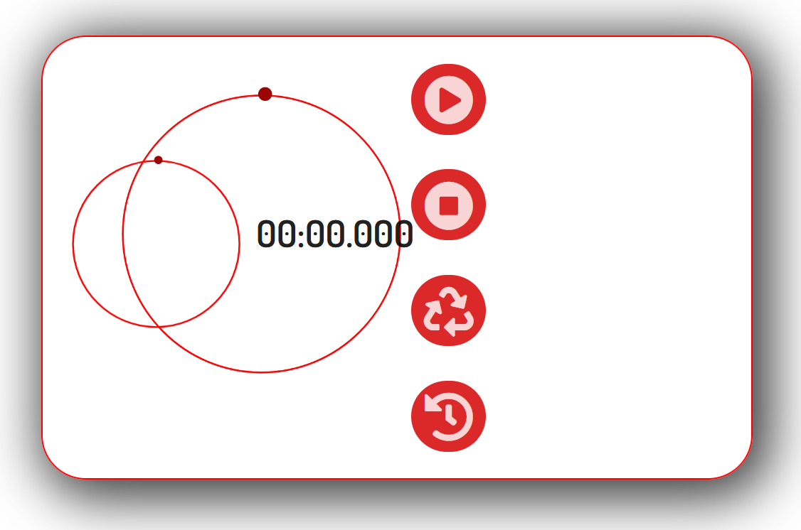
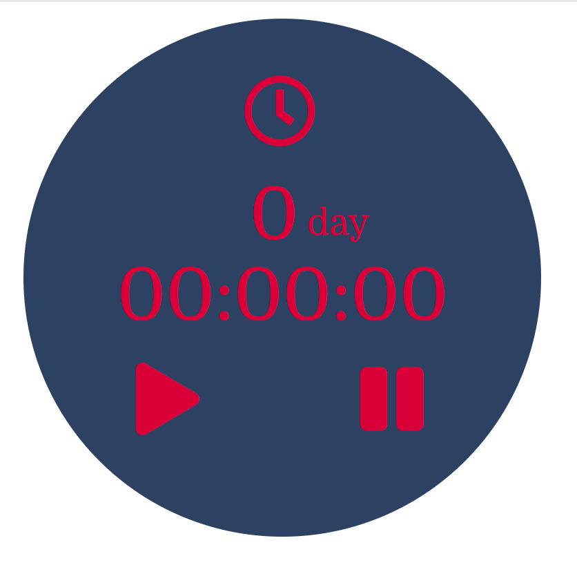

# REACT

In this folder you can find a few single React components (links at the end of this readme file)

## Short description ##
There are three simplest single components related to the clock. All these components solve the simplest daily tasks that the user can collide to - tracking the current time and the weather in the user's location, tracking time intervals (with the definition of the best (shortest) result), tracking time to a particular event.

## Used technologes, Libraries ##
- React
- Axios 

**Clock with current weather** was build on React class components

**Stopwatch** and **Timer** were build on React functional components

## The purpose of writing and basic questions ##
The main purpose of writing is a practical study:
- Technologies for receiving and processing API requests
- Transmitting state between React components
- Working with Date Object Methods

The main issues that have arisen:
- Differences in the display of layouts in various browsers.
- Difference in Timer (setInterval() method) in various browsers.

## Plans and conclusions ##
### Conclusions ###
1. I realize that I did not understand how to pass state between not related components, and also that the state passing from child components to parents was a laborious process (for me at that time). Because of this, I have bought the "React Redux" course (Udemy by Stephen Grider).

### Plans
I deliberately made different design for these components. In nearest plans - to make set (with the same design) of components which combine all these three components.

## 🔗 Links

<a href="https://github.com/MekhAnd/Practice/tree/main/React%20components/clock-with-weather" >**Clock with current weather** - folder</a>

<!-- [**README.md** - file](clock-with-weather/README.md) -->

<a href="https://github.com/MekhAnd/Practice/tree/main/React%20components/stopwatch" >**Stopwatch** - folder</a>

<!-- [**README.md** - file](stopwatch/README.md) -->

<a href="https://github.com/MekhAnd/Practice/tree/main/React%20components/timer" >**Timer** - folder</a>

<!-- [**README.md** - file](timer/README.md) -->