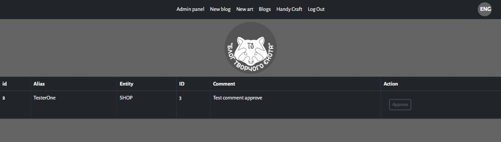

# BlogPost

This is a personal website with a simple trade zone (or exhibition zone) for people who provide defenete services (handy craft, repair, events...). Trade zone can be simple and quickly adapted for different kinds or types of businesses.
With this website you can:
- add your personal articles,
- arrange these articles with the help of #hashtags
- get some reaction from your followers (comments)
- put your personal goods (events, art products, training or something else).

This is project still in development!

<hr>

## Table of contents

1. [Technologies](README.md#technologies)
2. [Launch](README.md#launch)
3. [Tutorial](README.md#tutorial)
3. [Plan](README.md#plan)


<hr>

### [Technologies](#technologies)

*Front*
- **REACT 18.2.0** - https://reactjs.org/

*Back*
- **Node 16.15.0** - https://nodejs.org/en/
- **PostgreSQL 14.4** - https://www.postgresql.org/

#### **Libraries**

*Front*</br>
<hr>

- Axios - https://www.npmjs.com/package/axios </br>
- Bootstrap - https://getbootstrap.com/</br>
- Html-react-parser - https://www.npmjs.com/package/html-react-parser</br>
- Jwt-decode - https://jwt.io/</br>
- Lodash - https://lodash.com/</br>
**React**</br> 
- bootstrap - https://react-bootstrap.github.io/
- dom - https://reactjs.org/docs/react-dom.html
- quill - https://quilljs.com/
- redux - https://react-redux.js.org/
- router-dom - https://v5.reactrouter.com/web/guides/quick-start</br>
**Redux**
- thunk - https://www.npmjs.com/package/redux-thunk</br>

*Back*</br>
<hr>

- Bcrypt - https://www.npmjs.com/package/bcrypt
- Cors - https://www.npmjs.com/package/cors
- Dotenv - https://www.npmjs.com/package/dotenv
- Express - https://expressjs.com
- Express-fileupload - https://www.npmjs.com/package/express-fileupload
- Jsonwebtoken - https://jwt.io/
- PG - https://www.npmjs.com/package/pg
- PG-hstore - https://www.npmjs.com/package/pg-hstore
- Sequelize - https://www.npmjs.com/package/sequelize
- Uuid - https://www.npmjs.com/package/uuid

<hr>

#### [Launch](#launch)

Required pre installed React, Node JS and PostgeSQL. </br>
Clone this repository </br>

CD in to folder with project </br>
CD in to "blogpost-project"
Type  ```yarn``` or ```npm install``` to download all dependencies listed inside package.json.</br>
After all dependencies finish downloading without errors, type ```yarn start``` or ```npm start``` to start the front-end.

CD in to "server-blogpost"
Type  ```yarn``` or ```npm install``` to download all dependencies listed inside package.json.</br>
After all dependencies finish downloading without errors type ```yarn start``` or ```npm start``` to start the server part 

<hr>

#### [Tutorial](#tutorial)

| Screenshots | Description |
| ------ | ------ |
|| Main window, first part - Greeting photo and MOTO|
|| Main window, second part - trade (arts, exhibition) zone|
|| Main window, third part - left part - hashtags, right part - main (first or greeting) blog|
|| Main menu </br> **Blogs** - transition to blogs page.  </br> **Handycraft** - transition to trade (exhibition) zone.  </br> **Authorization** - transition to Signing, Logging page.  </br> **EN** - language switcher (ENG/UA). </br>|
|| Blogs window -  n this page you can overwatch all blogs
|| Handycraft zone - on this page you can overwatch handy works (or else) |
|| Authorization window |

**Description of interaction** </br>
After authorization, you can access certain features (depends on your role - access level).
Usually on the site there are three roles - ADMIN, AUTHOR, READER. </br>
**READER** - can leave comments. Certain field will appear after authorization.


**ADMIN** - can change user`s role.</br>
 - menu for ADMIN role</br>
For interaction with users` roles you should press **"Admin panel"** on main menu bar

After this, edit user`s role in a appropriate field, and press "Save" button


<hr/>

**AUTHOR** - can write (delete, edit) blogs, create (delete, edit) handicraft items, approve comments.</br>
 - menu for AUTHOR role </br>

**1** For creation new record in blog or in handycraft you should press **"New blog"** or **"New art"**. 
Interaction with this two pages is the same. </br>
In a new window:</br>

Fill all necessary fields.</br>
FYA in editor window you can:
- insert photos, video, web-links
- change fonts, font size, font colour, font type (bold, italic etc)
- choose different types of lists
- and more...

**2** For approving users` comments you should go on to "Admin panel" page.</p>

On this page you can see all new comments which users leave under your records:

Just read comments and press button "Approve" in order to confirm

**3** In order to edit blog or handycraft art, add hashtags or delete a record:
- choose appropriate post;
- scroll down till the end of post
- find this buttons panel 

And:
- in order to edit - press "Edit" button, new block will be open - change what you need in this block
- in order to delete - press "Delete" button
- in order to add hash tags - input tag or tags in field and after this press "Add tag" button

You also can delete every single comment under your records. In order to delete comment - press "Delete" button under this comment


### [Plan](#plan)

1. Add basket to handycraft item page.
2. Add "share with..." buttons panel.
3. Add "most popular" panel (based on quantity of users` comments) on Main window
4. Add design changes to some pages and/or components.
5. Add a system of rating for articles and for items from trade zone.
6. Add plugins for authorization with social networks.


<hr>

## 🔗 Links

<a href="https://github.com/MekhAnd/Practice/tree/main/React%20components/clock-with-weather" ></a>
[](https://www.linkedin.com/in/andrey-mekhanich/)
[](mailto:andrii.mekhanich@gmail.com?subject=[GitHub]%20Importantly)