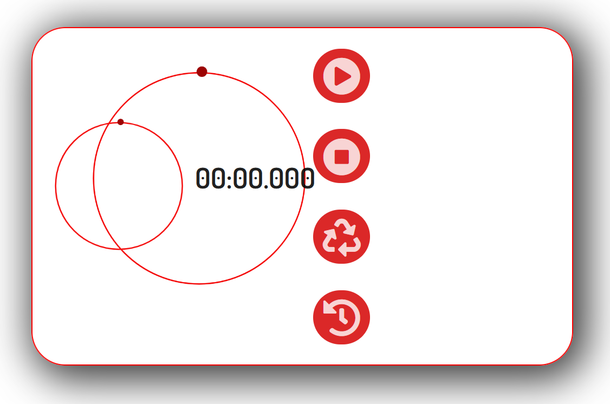
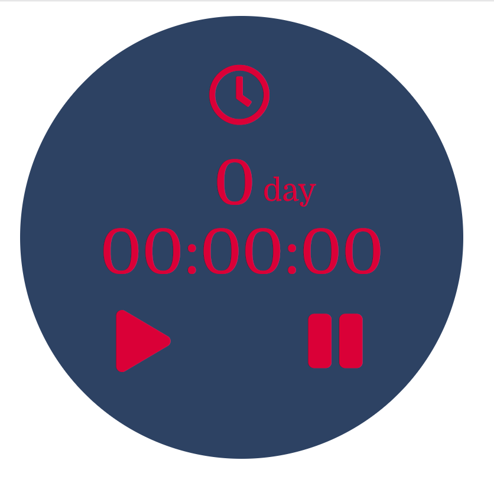

# WEBSITES

In this folder you can find personal projects (or pet-project) (links at the end of this readme file).

## Short description ##
**To-Do list** 

This is something similar to a daily organizer page or starting page.   
On this page you can:
- get current weather 
- get a short-term forecast (nearest 12 hours)
- get a long-term forecast (next 5 days)
- add some small notes (like a to-do list) day by day (the calendar was also implemented)
- and like small fun or bonus, you can read some inspiring quotes
All your notes will be stored in DB (in this case MongoDB). Also, a system of Authorizing and Authentication of users was implemented.

**Blogpost** 

This is a personal website with a simple trade zone (or exhibition zone) for people who provide defenete services (handy craft, repair, events...). Trade zone can be simple and quickly adapted for different kinds or types of businesses.
With this website you can:
- add your personal articles,
- arrange these articles with the help of #hashtags
- get some reaction from your followers (comments)
- put your personal goods (events, art products, training or something else).

A system of authorization and authentication was implemented, the owner has three types of user roles - Author (who will write, add or delete articles, approve comments), Admin (who can change user role), Reader (who can comment).

This project is still being developed. 

## Used technologies, Libraries ##
Used technologies:
- **React**
- **Redux**
- **Node**
- **MogoDB**
- **PostgreSQL**
- **Bootstrap**

Used libraries:
- Axios, Bcrypt, Body-parser, Cors, Dotenv, Express (express-fileupload), JSON web token (jwt decode), Loadash, Mongoose, HTML React parser, Passport, Pg (pg-hstore), Sequelize, Uuid

## The purpose of writing and basic questions ##
The main purpose of writing is a practical study:
- Technologies for receiving and processing API requests
- Transmitting state between React components
- Organization of server and website interaction
- Organizing  datascheme, and CRUD operation with different types (SQL DB and a NoSQL DB) of DB
- Implementation different types of user registration (Passport and JWT)

The main issues that have arisen:
- Difference in the display of layouts in different browsers.
- Understanding the process of transmitting state through Redux components and his methods. Redux work circle. I found many answers in  Udemy course by Stephen Grider. But still have ones)))

## Plans and conclusions ##

### Conclusions ###
1. I decide that I do not have clearly understanding of server side processes
Because of this I have bought the "Node JS" course (Udemy by Andrew Mead).

### Plans
I would like to implement in Blog project:
- a system of rating for articles and for items from trade zone
- simple basket for ordering items from trade zone
- hashtags for items from trade zone
- plugins for sharing articles or items in social networks
- plugins for authorization with social networks

## 🔗 Links

<a href="https://github.com/MekhAnd/Practice/tree/main/Websites/ToDo/back" >**To-Do** - folder...</a>, 
_[README.md](ToDo/back/README.md)_

<!-- 

<a href="https://github.com/MekhAnd/Practice/tree/main/React%20components/stopwatch" >**Stopwatch** - folder</a> -->

<!-- [**README.md** - file](stopwatch/README.md) -->

<!-- 

<a href="https://github.com/MekhAnd/Practice/tree/main/React%20components/timer" >**Timer** - folder</a> -->

<!-- [**README.md** - file](timer/README.md) -->

