# To-Do (starting page)


This is something similar to a daily organizer page or starting page.   
On this page you can:
- get current weather 
- get a short-term forecast (nearest 12 hours)
- get a long-term forecast (next 5 days)
- add some small notes (like a to-do list) day by day (the calendar was also implemented)
- and like small fun or bonus, you can read some inspiring quotes</br>
All your notes will be stored in DB (in this case MongoDB). Also, a system of Authorizing and Authentication of users was implemented.

<hr>

## Table of contents

1. [Technologies](README.md#technologies)
2. [Launch](README.md#launch)
3. [Tutorial](README.md#tutorial)


<hr>

### [Technologies](#technologies)

- **Node 16.15.0** - https://nodejs.org/en/
- **MogoDB 5.0.8** - https://www.mongodb.com/

#### Libraries

Axios - https://www.npmjs.com/package/axios </br>
Body-parser - https://www.npmjs.com/package/body-parser</br>
Dotenv - https://www.npmjs.com/package/dotenv</br>
Express - https://www.npmjs.com/package/express</br>
Express-session - https://www.npmjs.com/package/express-session</br>
Http-errors - https://www.npmjs.com/package/http-errors</br>
Mongoose - https://www.npmjs.com/package/mongoose</br>
Passport - https://www.npmjs.com/package/passport</br>
Passport-local - https://www.npmjs.com/package/passport-local</br>
Passport-local-mongoose - https://www.npmjs.com/package/passport-local-mongoose</br>

<hr>

#### [Launch](#launch)

Required pre installed Node JS and MongoDB. </br>
Clone this repository </br>
CD in to folder with project </br>
Type  ```yarn``` or ```npm install``` to download all dependencies listed inside package.json.</br>
After all dependencies finish downloading without errors, start your Mongo server and type ```yarn start``` or ```npm start``` to start the server.

<hr>

#### [Tutorial](#tutorial)

| Screenshots | Description |
| ------ | ------ |
|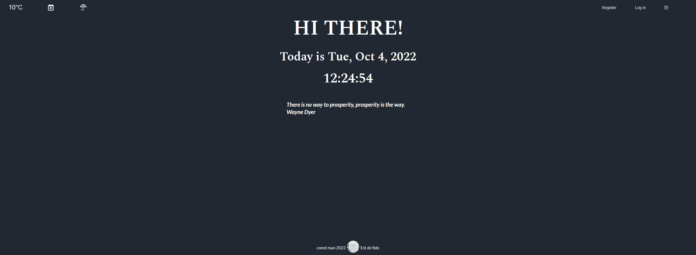| Main window|
|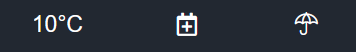| **MENU left part - press on this icon in order to see:**</br> 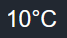 -  current weather in your location</br> 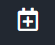 - Calendar and To-Do list</br> 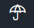 - 5 days weather forecast in your location|
|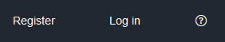|**MENU right part - press on this icon in order to see:**</br> 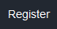 - for registration</br> 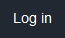 - for sign in</br> 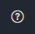 - help window|

**Description of interaction**
| Screenshots | Description |
| ------ | ------ |
|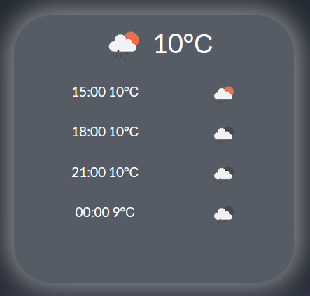| Сurrent weather in your location|
|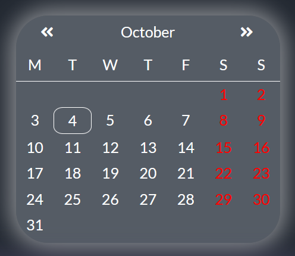| Calendar and To-Do list|
|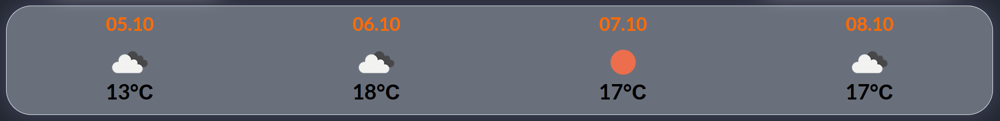| Weather forecast|

**Calendar and To-Do list**

1. In order to create an account press Register icon. You can use fake account in this case the main condition - at least 6 characters and "@" with "." should be included. After this you can sign in in your account with "Login" icon.
2. In order to create notes use "Calendar&ToDo" icon. Choose the date for your notes. In new panel </br> 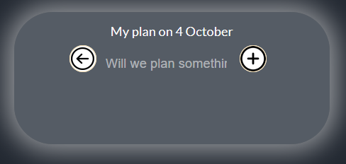</br> 
in field "Will we plan something" input your note. Press "+" icon for add note. 
In order to return to calendar panel press &#8592; icon. </br> 

<p style="color:red; font-weight:800;">Attention</p>


1. If you do not install MongoDB all your notes will not exist after reload your web browser.
2. If you do not register, all your notes will be writen under "Unknown user", so your notes will be avalible for all unregistred user.

<hr>


## 🔗 Links

<a href="https://github.com/MekhAnd/Practice/tree/main/React%20components/clock-with-weather" ></a>
[](https://www.linkedin.com/in/andrey-mekhanich/)
[](mailto:andrii.mekhanich@gmail.com?subject=[GitHub]%20Importantly)
